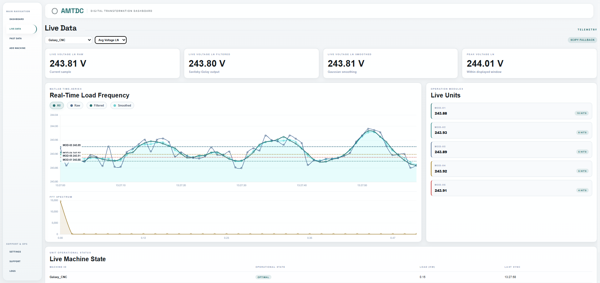
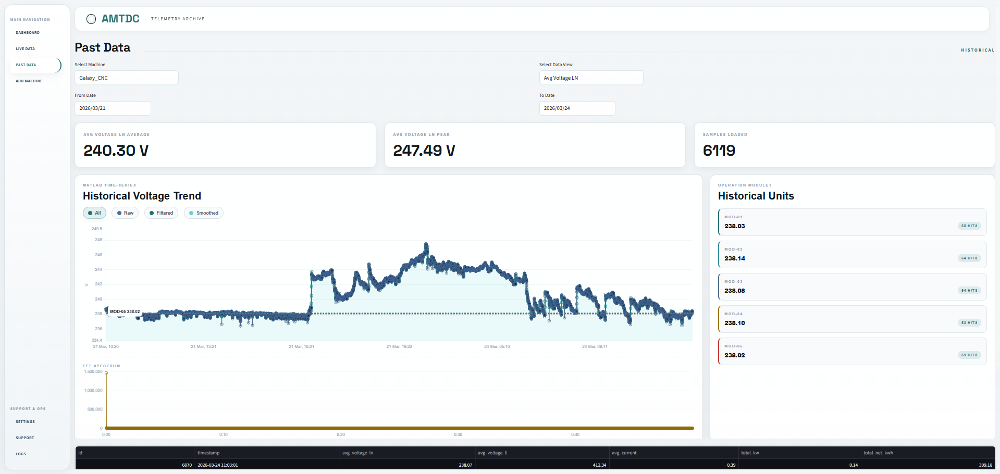
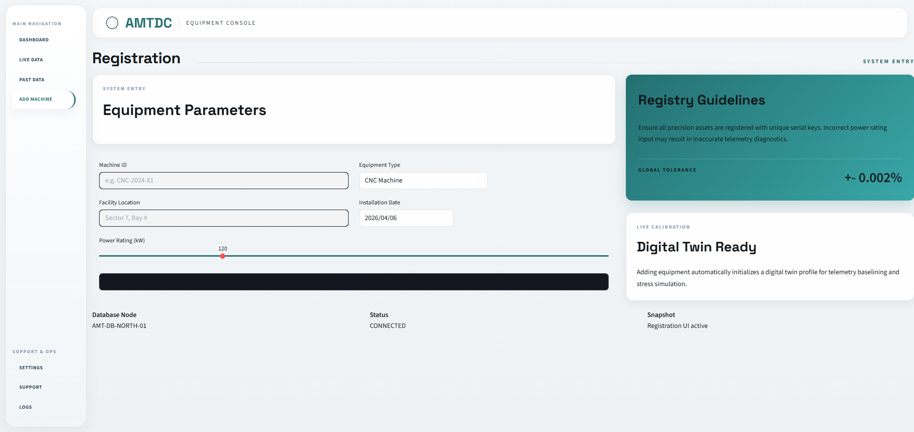

# Machine Energy Intelligence System

## Overview

This project focuses on monitoring and analysing machine-level power consumption to build intelligent insights around energy usage.

The system tracks voltage, current, and power consumption of machines in real-time, and uses that data to predict future energy usage, detect anomalies, and enable predictive maintenance.

It also estimates the operational cost of running machines — from simple appliances like air conditioners to industrial machinery used in manufacturing.

---

## 📸 System Interface

### Live Dashboard

Real-time monitoring of machine energy parameters

### Historical Data View

Analysis of past machine performance and consumption trends

### Add Machine Interface

Configuration panel for adding and managing machines

---

## Problem Statement

In most systems today, electricity cost is estimated roughly rather than measured precisely at the machine level.

This leads to:

* Inaccurate cost estimation in manufacturing
* Inefficient energy usage
* Unexpected machine failures
* Poor visibility into operational expenses

---

## Solution

This system introduces a data-driven approach to:

* Monitor real-time machine energy consumption
* Analyse usage patterns
* Predict future consumption trends
* Enable predictive maintenance
* Calculate accurate electricity costs per operation

---

## Key Features

* Real-time voltage and power monitoring
* Machine-level energy tracking
* Predictive analytics for consumption
* Cost estimation for operations
* Scalable for both small and industrial use cases

---

## ⚙️ Configuration Note (Important)

To run this system locally or connect to actual machines:

* The **IP address and Port number must be configured manually** in the code.
* These values define the connection to the data source (e.g., Modbus device or machine interface).

👉 Update the configuration inside the relevant files (such as data fetcher or settings module) before running the application.

---

## Use Cases

* Cost estimation for manufacturing processes
* Monitoring AC or equipment usage in buildings
* Industrial energy optimisation
* Predictive maintenance for machinery
* Smart energy auditing

---

## Future Scope

* Integration with IoT sensors
* Machine learning models for prediction
* Automated alerts for anomalies
* Advanced real-time analytics dashboard
* Integration with ERP / industrial systems

---

## Status

Work in progress — actively being developed and expanded.

---

## Vision

To build a system where energy is not just consumed, but understood, optimised, and predicted.
